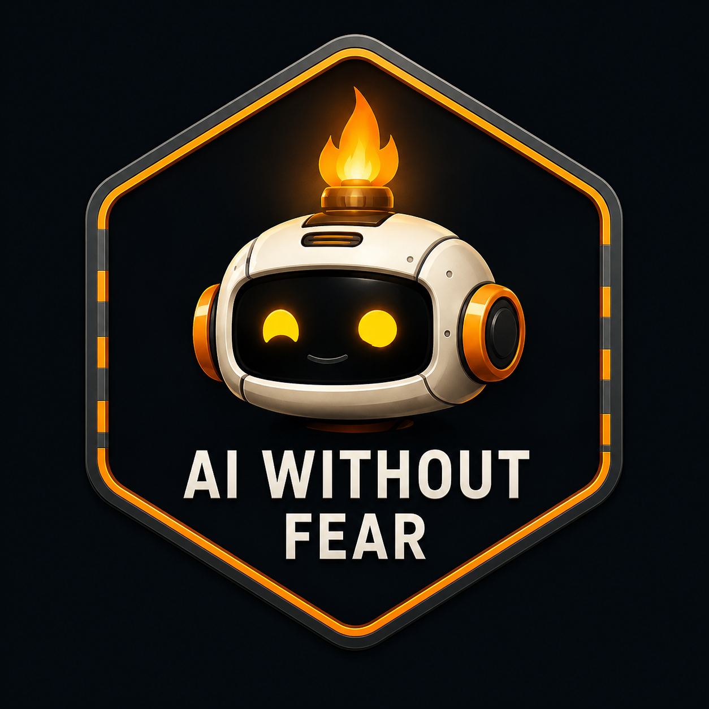

  

<h1 align="center">Hey, I'm Shawn</h1>

  <strong>AI Without Fear</strong> 
  Local AI tools for real hardware: Windows, consumer GPUs, local models, diffusion workflows, training tools, and source-backed retrieval.

  
  
  

  
  
  

---

## What I'm building

I build local AI tools for people running real machines at home. The target is not a clean cloud demo. It is a Windows box with an RTX GPU, mixed model folders, broken paths, and a user who still wants the tool to work.

AI Without Fear is the umbrella for that work: local creative AI, grounded retrieval, model routing, and training interfaces that normal users can inspect.

---

## Featured work

### AIWF Studio

  
  

AIWF Studio is a local-first workspace for image generation, inpainting, video, and video-audio post-processing on Windows and NVIDIA GPUs.

It rebuilds the familiar Stable Diffusion web UI idea with typed requests, explicit backend services, repo-local model folders, and less global state. The public branch focuses on image generation, inpaint, ControlNet, enhancement, segmentation, Wan video, LTX, Flux, and the newer React Pro UI.

Status: early public build. Not a finished replacement for AUTOMATIC1111, Forge, or ComfyUI.

[View AIWF Studio](https://github.com/nawnie/AIWF-Studio)

---

### AIWF Research Atlas

  
  

AIWF Research Atlas is a source-backed retrieval corpus for local AI assistants.

Atlas keeps source policy, retrieval cards, topic lanes, Gradio 6 material, ComfyUI notes, evaluation prompts, and provenance files in one indexable tree. The job is simple: make assistants check grounded project context before they invent setup steps.

Status: v3.3 research preview. Fast-moving package, model, API, benchmark, license, and compatibility claims still need live source checks before use.

[View AIWF Research Atlas](https://github.com/nawnie/ai-without-fear)

---

### Model Operating Kernel

  
  

Model Operating Kernel is a local runtime layer for coordinating model and expert backends on consumer hardware.

MoK registers experts, routes requests, tracks VRAM pressure, calls local or HTTP-backed models, writes JSONL traces, and exports data for routing evaluation. It is not an in-model MoE system. It is the control layer around models.

Status: early runnable slice. The next job is to collect real local traces, measure VRAM behavior, and test routing quality against repeatable eval sets.

[View Model Operating Kernel](https://github.com/nawnie/Model-Operating-Kernel)

---

## Newer 2026 work

### ReTrain

[ReTrain](https://github.com/nawnie/ReTrain) is a local-first training workbench for consumer GPU fine-tuning. It is also public proof-of-work for RNV1: working software we built to train, test, and document local model-improvement flows instead of only describing the idea.

### RNV1

[RNV1](https://github.com/nawnie/MOKSHA) is the investor-facing page for the embodied local AI program that was previously staged as MOKSHA. It keeps the core implementation private and points to public proof-of-work, especially ReTrain, Model Operating Kernel, and AIWF Research Atlas.

### Atlas Reader LoRA Lab

[Atlas Reader LoRA Lab](https://github.com/nawnie/atlas-lora-adapter) tests whether a small QLoRA adapter can learn to read structured Atlas context. It is an internal lab, not a production package or universal token-reduction claim.

---

## How I work

- Consumer hardware first: RTX 4070 Ti Super, RTX 4070 Laptop, Windows setups, local paths, and VRAM limits shape the design.
- Source-backed answers: AI tools should retrieve project knowledge before guessing.
- Recorded limits: demos are useful only when the failure cases and claims are written down.
- Local runtime boundaries: models, outputs, SDKs, and private traces should stay local unless the repo says otherwise.

---

## Stack

  
  
  
  
  
  
  
  

---

## Support the work

If AIWF Studio, Atlas, MoK, or my local AI notes save you setup time, you can support continued development:

  

---

  <strong>AI Without Fear</strong> 
  <em>Local AI tools for real people, on real hardware.</em>

